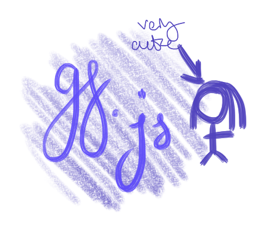

# gf.js

> i think i have a gf i dont entirely know how a gf is defined but i think she is so i made this library to help me

# What is it?
This is a library to help me specifically know if she is my girlfriend or not.

## Why does this exist?
A friend made a joke and I made it into reality.

## Usage

https://www.npmjs.com/package/@alskfjsjfds/gf.js
```shell
# To install the package in your project ()
npm install --save @alskfjsjfds/gf.js
```

```js
import { gf } from 'gf.js';
console.log(gf); // undefined
```

### Development
Any pull requests or issues that have more input on this situation would be very helpful.

## Why should I care?
Because I am very gay. Thank you for your time.
